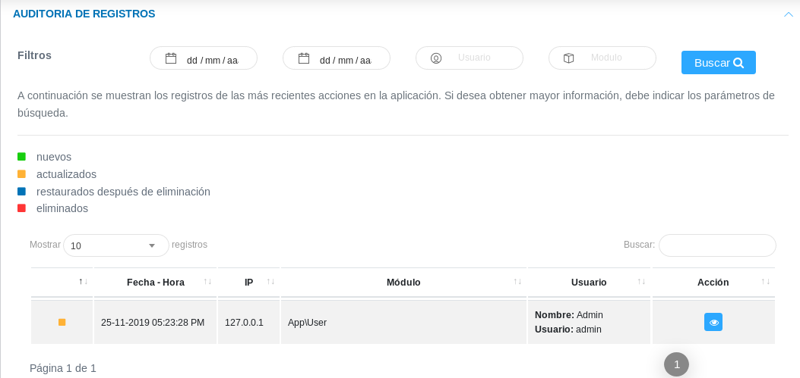
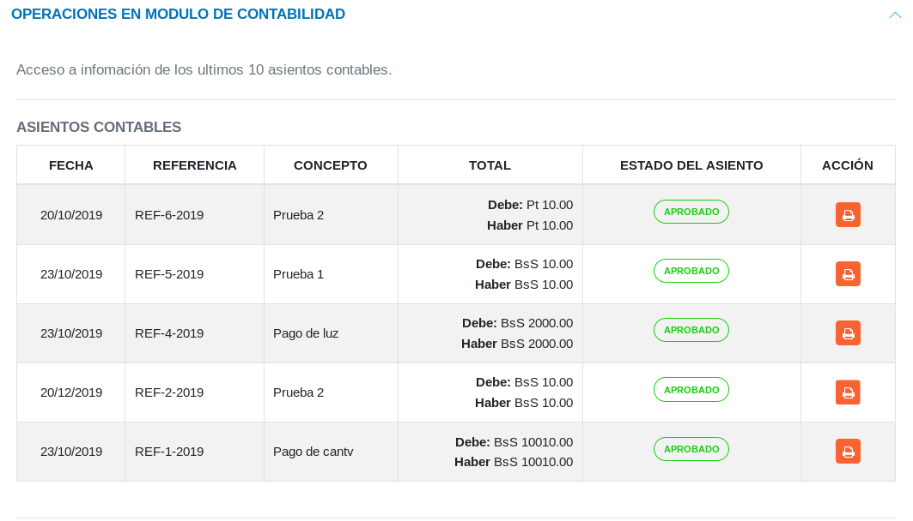
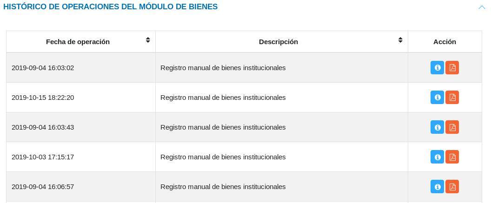
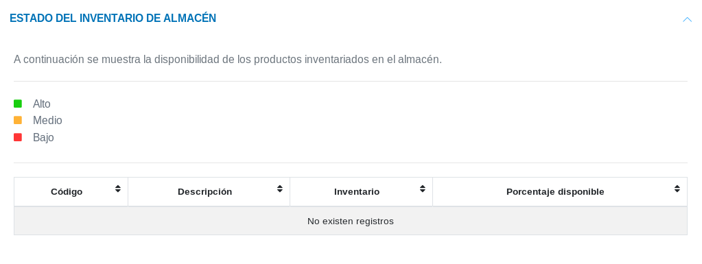

# Administración del sistema 
****************************

La aplicación inicialmente contará con una configuración por defecto que el usuario administrador debe completar a través de los elementos funcionales del sistema, que permitirán ajustar el uso del KAVAC a la estructura organizativa y características de la institución usuaria.   A través del panel de control y la configuración se definirán los parámetros útiles para la consolidación del sistema con relación a las instituciones, sus sedes y características organizacionales.   

##Panel de control  

El panel de control es una herramienta de administración del sistema kavac que permite observar los datos de transacción de operaciones conjuntas a los distintos módulos que integran el sistema.   Las distintas secciones de este módulo permiten visualizar, buscar y organizar datos relacionados con el acceso a la aplicación, auditoria de registros, operaciones en los módulos de contabilidad; bienes y almacén, estatus de datos que se muestran a través de gráficos o datos tabulados.   Además; posee una sección útil para el manejo de elementos del sistema destinada para desarrolladores. 

###Herramientas para desarrolladores 

Esta sección esta dirigida para usuarios desarrolladores, muestra elementos útiles para la construcción de nuevas funcionalidades de la aplicación.  A través de esta sección se administran las herramientas de la interfaz gráfica como los iconos disponibles para usar a lo largo del sistema, botones, gestión de formularios, registro de eventos, estructura de gráficos y tablas.   Así mismo, se muestra una opción de ajustes para configurar el estado del sistema ya sea modo mantenimiento, demostración o depuración. 

##Control de acceso a la aplicación 

###Acceso a la aplicación

Esta sección permite visualizar y gestionar información de cuentas de usuarios registradas. Desde esta herramienta el usuario administrador puede visualizar los roles de usuarios, nombre de usuarios, direcciones IP, estatus ( usuario conectado o desconectado) y ultima conexión.   La sección permite al usuario administrador gestionar la cuenta de usuario a través de la columna titulada “Acción”.

Las herramientas que se muestran en la columna “Acción” corresponden a la de enviar mensaje, configurar cuenta de usuario, enviar notificación, ver información del usuario y asignar permisos de acceso respectivamente.      

   

###Auditoría de registros 

Esta sección es una herramienta para visualizar e inspeccionar los registros realizados.    Es versátil al momento de filtrar nuestras búsquedas a través de parámetros establecidos por el usuario como campos de búsqueda y elementos de representación al nivel de interfaz gráfica. 

Para realizar una auditoría o seguimiento de un registro de cuenta usuario, es necesario acceder al panel de control, sección auditoría de registro y proceder a buscar el registro.   Es posible filtrar la información indicando los parámetros de búsqueda como intervalos de fechas, nombre de usuario o módulo al que pertenece.   De igual manera se muestra una serie de datos tabulados con información asociada a los registros de cuenta usuario como dirección IP, módulo al que se encuentra adscrito, nombre y detalles del registro(fecha de registro, actualización, restauración o eliminación).  

###Restaurar registros eliminados 

Esta sección permite renovar los registros que han sido eliminados, la sección presenta un historial de registros eliminados con información relacionada  de forma tabulada.  Para completar la restauración de un registro es necesario ingresar al panel de control del sistema luego dirigirse a la sección de restaurar registros eliminados y a través de los parámetros de busqueda es posible filtrar los datos y facilitar la busqueda.   En los parámetros de busqueda se establece un intervalo de fechas que compren los registros realizados dentro de ese intervalo de fechas.  Es posible también filtrar la información por módulo. 

 Mediante el uso del botón ubicado en los datos tabulados especificamente en la columna titulada acción es posible completar la restauración del registro. 

##Módulo de contabilidad

A través del panel de control es posible realizar un seguimiento de los asientos contables registrados en el sistema a partir de la sección de operaciones en el módulo de contabilidad del panel de control.   En esta sección se muestra en forma tabulada registros de asientos contables con información relacionada con la fecha de registro, referencia, concepto referente a la operación, total relacionado con la partida doble (debe y haber del asiento), el estado  del asiento contable y la posibilidad de generar una impresión a través del botón que se muestra en la columna titulada acción. 

El panel de control permite visualizar los diferentes reportes generados a partir del módulo de contabilidad.    En la sección de reportes de contabilidad se muestra de forma tabulada los reportes generados e información relacionada con cada uno de ellos. 

##Módulo de bienes 

En el panel de control se presentan dos secciones relacionadas con las operaciones en el módulo de bienes. Una sección corresponde a los gráficos del inventario de bienes institucionales, dada por la relación entre los datos cuantitativos y la identificación de cada bien. 

En esta sección es posible seleccionar un modo de visualización de gráficas, ya sea gráfica de barras, circular o lineal (estas gráficas son configuradas previamente por el desarrollador en el panel de control).    De igual forma, es posible seleccionar los datos que el sistema representará gráficamente ya sean existentes, mas solicitados o menos solicitados.  

###Historial de operaciones módulo de bienes

##Módulo de almacén 

El panel de control a través de tres secciones relacionadas con el módulo de almacén permite tener un control de algunas operaciones especificas que se llevan a cabo sobre este módulo.  La sección del estado del inventario permite visualizar la disponibilidad de productos expresado en terminos porcentuales, además de expresar estos datos de manera gráfica.   De igual forma, se muestra un historial de operaciones del módulo de almacén.   

