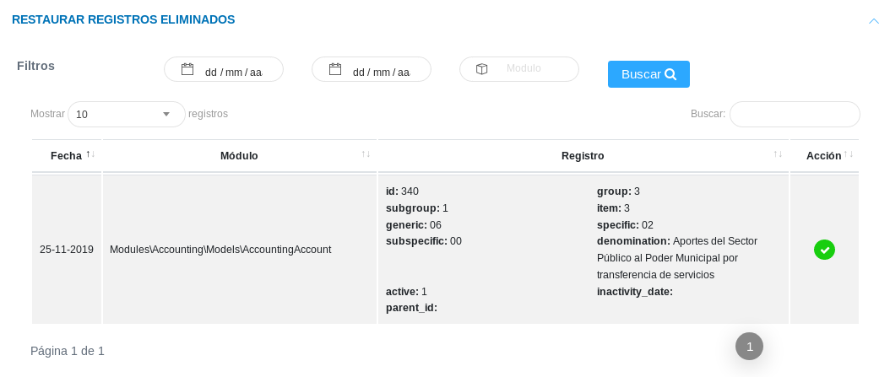
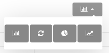

# Administración del sistema 
****************************

La aplicación inicialmente contará con una configuración por defecto que el usuario administrador debe completar a través de los elementos funcionales del sistema, que permitirán ajustar el uso del KAVAC a la estructura organizativa y características de la institución usuaria.   A través del <b>Panel de Control</b> y la <b>Configuración</b> se definirán los parámetros útiles para la consolidación del sistema con relación a las instituciones, sus sedes y características organizacionales.   

##Panel de Control  

El <b>Panel de Control</b> es una herramienta de administración del sistema KAVAC que permite observar los datos de transacción de operaciones conjuntas a los distintos módulos que integran el sistema.   Las distintas secciones de este módulo permiten visualizar, buscar y organizar datos relacionados con el acceso a la aplicación, auditoria de registros, operaciones en los módulos de contabilidad, bienes y almacén, estatus de datos que se muestran a través de gráficos o datos tabulados.   Además; posee una sección útil para el manejo de elementos del sistema destinada para desarrolladores. 

###Herramientas para desarrolladores 

Esta sección está dirigida para usuarios desarrolladores, muestra elementos útiles para la construcción de nuevas funcionalidades de la aplicación.  A través de esta sección se administran las herramientas de la interfaz gráfica como los iconos disponibles para usar a lo largo del sistema, botones, gestión de formularios, registro de eventos, estructura de gráficos y tablas.   Así mismo, se muestra una opción de ajustes para configurar el estado del sistema ya sea modo mantenimiento, demostración o depuración. 

##Control de acceso a la aplicación 

###Acceso a la aplicación

Esta sección permite llevar un control de acceso a la aplicación, además de visualizar y gestionar información de cuentas de usuarios registradas. Desde esta herramienta el usuario administrador puede visualizar los roles de usuarios, nombre de usuarios, direcciones IP, estatus (usuario conectado o desconectado) y ultima conexión.   La sección permite al usuario administrador gestionar la cuenta de usuario haciendo uso de los botones ubicados en la columna titulada <b>Acción</b>.

Los botones ubicados en la columna titulada <b>Acción</b> son herramientas que permiten:  

 - Enviar mensaje 
 - Configurar cuenta de usuario 
 - Enviar notificación 
 - Ver información del usuario  
 - Asignar permisos de acceso respectivamente	      
 

###Auditoría de registros 

Esta sección es una herramienta para visualizar e inspeccionar los registros de cuenta usuario realizados.    Es versátil al momento de filtrar nuestras búsquedas a través de parámetros establecidos por el usuario. 

Para realizar una auditoría o seguimiento de un registro de cuenta usuario, es necesario seguir los seguir los siguientes pasos: 
 
 - Acceder al <b>Panel de Control</b> y ubicarse en la sección <b>Auditoria de Registro</b>
 - Proceder a buscar el registro en los datos tabulados.   Es posible filtrar la información indicando los parámetros de búsqueda como la fecha comprendida del registro, nombre de usuario o módulo al que pertenece. 
 - De igual manera se muestra una serie de datos tabulados con información asociada a los registros de cuenta usuario  
 - Haciendo uso del boton ubicado en la columna titulada <b>Acción</b> es posible observar mas detalles sobre el registro  

###Restaurar registros eliminados 

Esta sección permite renovar los registros que han sido eliminados, la sección presenta un historial de registros eliminados con información relacionada  de forma tabulada.  

Para completar la restauración de un registro es necesario:

- Ingresar al <b>Panel de Control</b> del sistema 
- Dirigirse a la sección de <b>Restaurar Registros Eliminados</b>  
- A través de los parámetros de búsqueda es posible filtrar los datos y facilitar la búsqueda.    
- Para completar la restauración de un registro, hacemos uso del boton ubicado en la columna titulada <b>Acción</b>

##Módulo de contabilidad

###Operaciones módulo de contabilidad

A través del <b>Panel de Control</b> es posible realizar un seguimiento de los asientos contables registrados en el sistema a partir de la sección de <b>Operaciones en Módulo de Contabilidad</b> del <b>Panel de Control</b>.   En esta sección se muestra en forma tabulada registros de los asientos contables con información relacionada con la fecha de registro, referencia, concepto referente a la operación, total relacionado con la partida doble (debe y haber del asiento) y el estado  del asiento contable. Es posible generar una impresión haciendo uso del boton ubicado en la columna titulada acción para obtener mas detalles. 

###Reportes de contabilidad

El <b>Panel de Control</b> permite visualizar los diferentes reportes generados a partir del módulo de contabilidad.    En la sección de <b>Reportes de Contabilidad</b> se muestra de forma tabulada los reportes generados e información relacionada con cada uno de ellos. 

Los reportes son generados desde el <b>Módulo de contabilidad</b>, y a través del <b>Panel de Control</b> es posible visualizar detalles de estos reportes. 

##Módulo de bienes 

###Gráficos del inventario de bienes 

El <b>Panel de Control</b> presenta una sección relacionada con los bienes institucionales.  La sección de <b>Gráficos del Inventario de Bienes Institucionales</b>, representa la cantidad de recursos en función de los bienes institucionales. Es posible seleccionar los datos que el sistema representará gráficamente ya sean bienes existentes, más solicitados o menos solicitados, haciendo uso de los botones de selección. 

El sistema permite seleccionar un modo de visualización de gráficas, ya sea gráfica de barras, circular o lineal (estas gráficas son configuradas previamente por el desarrollador en el <b>Panel de Control</b>). 

###Historial de operaciones módulo de bienes

El sistema permite contar con un seguimiento de las operaciones en el <b>Módulo de Bienes</b>, a través de la sección <b>Histórico de Operaciones del Módulo de Bienes</b>. Los datos tabulados muestran una descripción y fecha de la operación, haciendo uso de los botones ubicados en la columna titulada <b>Acción</b> es posible generar un reporte y ver mas detalles de la operación.      

##Módulo de almacén 

El <b>Panel de Control</b> a través de tres secciones relacionadas con el módulo de almacén permite tener un control de algunas operaciones específicas que se llevan a cabo sobre este módulo.  La sección del <b>Estado del inventario</b> permite visualizar la disponibilidad de productos expresado en términos porcentuales, además de expresar estos datos de manera gráfica, en la sección de <b>Gráficos del Inventario de Productos en Almacén</b>.      

	

El sistema permite contar con un seguimiento de las operaciones en el <b>Módulo de Almacén</b>, a través de la sección <b>Histórico de Operaciones del Módulo de Almacén</b>. Los datos tabulados muestran una descripción y fecha de la operación, haciendo uso de los botones ubicados en la columna titulada <b>Acción</b> es posible generar un reporte y ver mas detalles de la operación.

