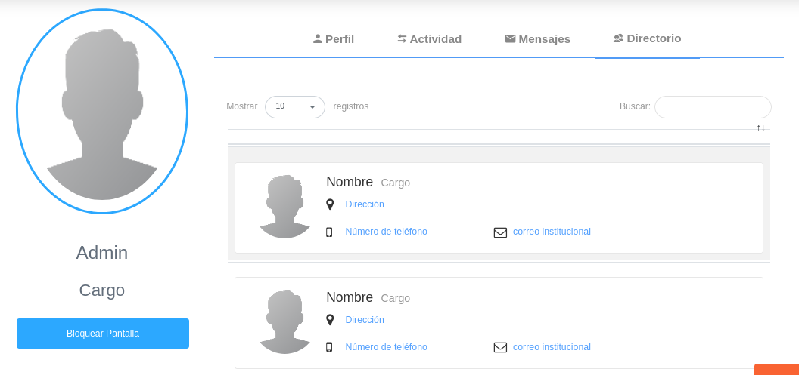
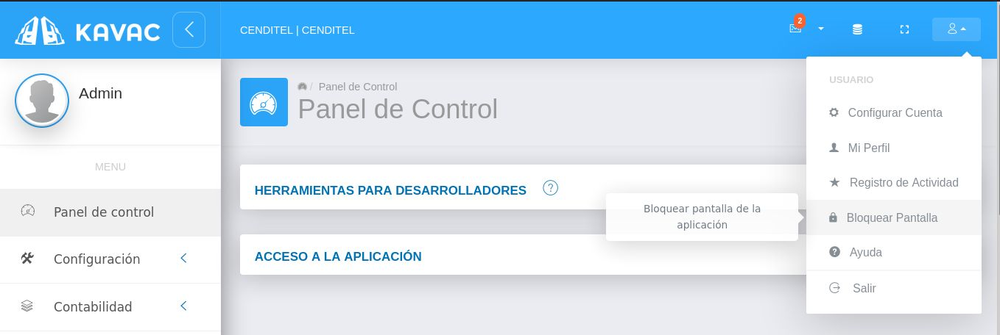

#Control de Acceso a la Aplicación  
**********************************

##Acceso a la aplicación

Esta sección permite llevar un control de acceso a la aplicación, además de visualizar y gestionar información de cuentas de usuarios registradas. Desde esta herramienta el usuario administrador puede visualizar los roles de usuarios, nombre de usuarios, direcciones IP, estatus (usuario conectado o desconectado) y ultima conexión.   La sección permite al usuario administrador gestionar la cuenta de usuario haciendo uso de los botones ubicados en la columna titulada **Acción**.

Figura 24: Acceso a la Aplicación

Los botones ubicados en la columna titulada **Acción** son herramientas que permiten:  

 - Enviar mensaje 
 - Configurar cuenta de usuario 
 - Enviar notificación 
 - Ver información del usuario  
 - Asignar permisos de acceso 	      
 

##Auditoría de registros 

Esta sección es una herramienta que permite visualizar e inspeccionar los registros realizados desde una cuenta de usuario.    Es versátil al momento de filtrar nuestras búsquedas a través de parámetros establecidos por el usuario. 

Figura 25: Auditoría de Registros

Para realizar una auditoría o seguimiento de un registro de cuenta usuario, es necesario seguir los siguientes pasos: 
 
 - Acceder al **Panel de Control** y ubicarse en la sección **Auditoría de Registro**
 - Proceder a buscar el registro en los datos tabulados.   Es posible filtrar la información indicando los parámetros de búsqueda como la fecha comprendida del registro, nombre de usuario o módulo al que pertenece. 
 - De igual manera se muestra una serie de datos tabulados con información asociada a los registros de cuenta usuario  
 - Haciendo uso del botón ubicado en la columna titulada **Acción** es posible observar de forma más detallada la información del registro  

##Restaurar registros eliminados 

Esta sección permite restaurar los registros que han sido eliminados, la sección presenta un historial de registros eliminados con información detallada del registro de forma tabulada.  

Figura 26: Restaurar Registros Eliminados

Para completar la restauración de un registro es necesario:

- Ingresar al **Panel de Control** del sistema 
- Dirigirse a la sección de **Restaurar Registros Eliminados**  
- A través de los parámetros de búsqueda es posible filtrar los datos y facilitar la búsqueda.    
- Para completar la restauración de un registro, hacemos uso del boton ubicado en la columna titulada **Acción**

