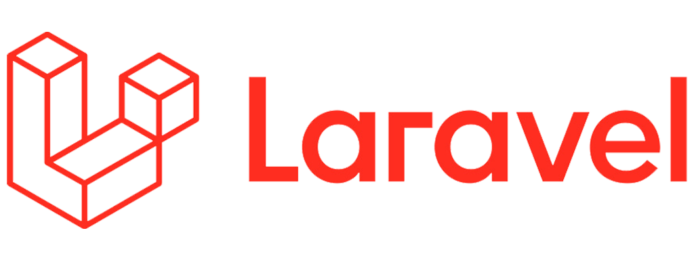
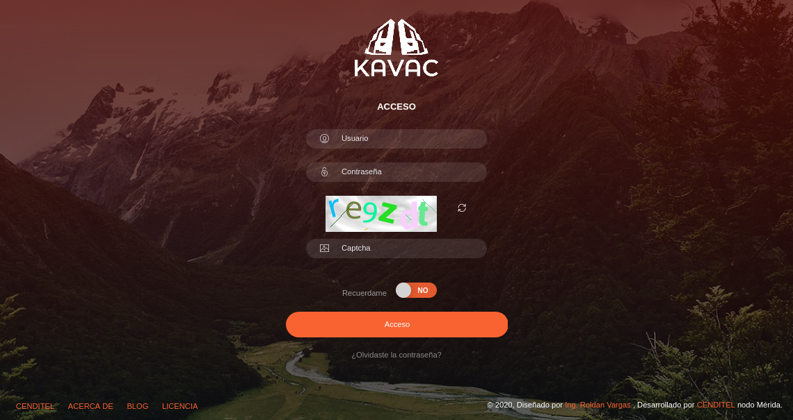
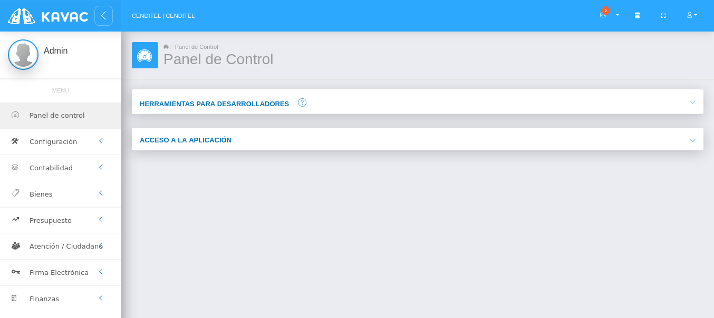
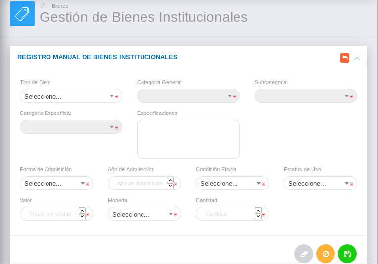

# Información General
*********************

## Tecnología empleada

KAVAC se desarrolla en lenguaje PHP y el framework Laravel bajo un esquema de Programación orientada a objetos (POO) y una arquitectura cliente - servidor, el uso de este framework permite solventar algunas deficiencias del lenguaje en sí como lo es la gestión de grandes volúmenes de datos y cálculos inherentes a la información, con la implementación de métodos dispuestos en la capa ORM (mapeo objeto-relacional) que optimizan la respuesta obtenida por el servidor de base de datos ante distintas magnitudes de consultas, además de contar con funciones que permiten realizar diferentes tareas enfocadas al mejor rendimiento de la aplicación.

PHP es considerado uno de los lenguajes Open Source más utilizados en el desarrollo de aplicaciones web y es el lenguaje primordial en la mayor parte de servidores de hospedaje. Como parte de su constante proceso de evolución, en sus últimas versiones (a partir de la 7.x) ha mejorado en cuanto a sintaxis (menos código por el mismo resultado y mejoras en sus funcionalidades), rendimiento, de fácil configuración, con una amplia gama de paquetes disponibles para su uso libre y mejoras en el tratamiento de información.

Por su parte, Laravel es un framework de desarrollo para PHP el cual cuenta con una gran cantidad de funcionalidades que permite: mejorar el rendimiento de los procesos, prevenir la exposición ante ataques conocidos, continua actualización en pro de mejoras sustanciales, amplia comunidad de desarrollo, núcleo basado en Symfony, documentación sustancial en todos los componentes del framework, disponibilidad de una gran diversidad de paquetes Open Source que pueden ser implementados sin complejidad, configuración sencilla, gestión de recursos del servidor de aplicación,  base de datos de una forma óptima y sintaxis intuitiva.

En el desarrollo de la aplicación administrativa para la gestión de recursos KAVAC se plantea implementar, en cuanto a la optimización de algunos procesos que requieren cálculos a gran escala, el uso de:

  
   - Procedimientos almacenados: No dependen del lenguaje de desarrollo sino de la capacidad del gestor de base de datos en las tareas de cálculo y gestión de la información.

   - Tareas programadas o delegadas: Permite delegar tareas de cómputo a la capacidad de cálculo del servidor sin obstruir el funcionamiento de la aplicación. 

   - Interacción directa con el servidor: Posibilidad de interactuar directamente con el servidor de base de datos sin depender del lenguaje de desarrollo acelerando el proceso de consulta y gestión de la información.
    
   - Disparadores de eventos: Generar notificaciones al usuario cuando una tarea haya sido culminada por el servidor.
   
   - Gestión de caché: Almacenar información en la caché del servidor para no repetir consultas cada vez que esta sea solicitada a menos que la misma haya sido modificada, lo cual permitirá tiempos de respuesta casi imperceptibles.
   
   - Configuraciones sugeridas en un entorno en producción de aplicaciones web
 
   - Lenguaje de Desarrollo: Optimización de las variables de configuración dispuestas por el lenguaje para mejorar su rendimiento y aumentar las capacidades del mismo (aplica para cualquier lenguaje de desarrollo).
   
   - Clúster de Servidores de Base de Datos: Permite la optimización y mejoras en cuanto al tiempo de respuesta en la capacidad de cálculo. Importante tomar en cuenta para la gestión de grandes volúmenes de datos pero no limitativo.
   
   - Balanceo de Cargas: Configuración de un esquema de cargas balanceadas tanto en la capa del servidor de aplicación.

## Interfaz gráfica

**Página de ingreso**
   
La ventana de ingreso (Figura 3) está conformada por una imagen de fondo, una serie de campos de verificación correspondientes a la cuenta de usuario, contraseña y un campo de verificación de captcha. El campo de verificación de captcha se completa conforme al texto descrito en la imagen, dicha imagen tiene la posibilidad de ser actualizada para mejorar la visualización del texto descrito. El botón de selección permiten recordar contraseña al momento de un nuevo inicio de sesión.

Figura 3: Página Ingreso

**Elementos de identificación**

Dentro de los elementos de identificación como componentes de nuestra interfaz gráfica se encuentra el logo original y título del sistema KAVAC (Figura 4).

Figura 4: Elemento de Identificación

**Página inicial**

Página inicial o área de trabajo (Figura 5), se encuentra estructurada por una serie de elementos de navegación conformando el sistema y haciéndolo intuitivo a través de una barra de navegación superior, un panel lateral o menú del sistema, y el panel principal de operaciones.

Figura 5: Página Inicial

**Panel superior**

Panel superior o barra de navegación (Figura 6), se distribuye de la siguiente manera, en la parte izquierda se muestra el logo KAVAC y un botón de despliegue para ocultar y mostrar el panel lateral, a la derecha se muestran una serie de herramientas funcionales como lo son: buzón de mensajes, <!-- selector de idioma --> configuración de base de datos, pantalla completa y configuración de cuenta usuario.

Figura 6: Panel Superior

**Panel lateral**

Panel lateral o menú del sistema (Figura 7), ubicado al lado izquierdo es el menú principal del sistema donde se ubican cada uno de los módulos o aplicaciones, cada módulo posee un botón con opción de despliegue para las subcategorías en que se divide dicho módulo.

Figura 7: Panel Lateral

**Panel principal**

Panel principal (Figura 8), es la ventana de operaciones en general de todas las actividades a realizar y registradas, cuenta con barras de navegación, buscadores, tablas de contenido en forma clasificada, gráficos y campos de registro. Se encuentra identificado en la parte superior de la ventana dependiendo el área en la que se está trabajando. 

Figura 8: Panel Principal

##Botones

Dentro de los elementos funcionales comunes de la interfaz gráfica del sistema se encuentran los siguientes elementos:

**Acciones de formulario**

Se muestran tres botones comunes para las ventanas del sistema, elementos que corresponden a las funciones de borrar datos, cancelar y guardar respectivamente.

**Acciones de registro**

Estos elementos corresponden a las funciones de regresar, crear nuevo registro e imprimir respectivamente.

   
Estos elementos corresponden a las funciones de editar, borrar, ver y aprobar registro respectivamente.

Estos elementos corresponden a las funciones de buscar, subir y descargar datos respectivamente.

**Botón de ayuda**

El botón de ayuda que observamos en el encabezado de cada sección es un elemento que tiene la función de guiar al usuario en el sistema a través de un tutorial a nivel de interfaz gráfica (Figura 9). Este muestra detalladamente las especificaciones de cada funcionalidad del sistema. 

Figura 9: Botón de Ayuda

##Sobre los usuarios

Los usuarios afiliados y sus interacciones con el sistema se administra a través de la funcionalidad de gestión de roles incorporada en el módulo de configuración, donde  se pueden crear roles y asignar los permisos correspondientes al mismo, garantizando así el acceso a la información de acuerdo a diversos niveles de seguridad. 

**Usuarios asociados al sistema KAVAC**:

**Usuario**:

El sistema registrará este actor sin ningún tipo de rol asignado, por consiguiente, tendrá acceso limitado a través del sistema.

**Administrador**:

El rol de usuario como administrador, le permitirá a este actor contar con una permisología completa sobre todo el sistema, es decir, el administrador es el actor más importante con acceso a todas las áreas del sistema, con el fin de desempeñar funciones como registro de nuevos usuarios, asignación de roles, concesión de permisología, aprobación o desaprobación de solicitudes entre otros.

**Desarrollador**:

El rol de usuario como desarrollador le permitirá a este actor contar con la permisología de acceso a las diferentes áreas relacionadas con asistencia técnica y funcionabilidad de la aplicación.

**Otros usuarios**:

Los roles de usuarios listados a continuación: soporte, contabilidad, bienes, presupuesto, finanzas, nómina, almacén, compra, comercializacion, OAC; permitirán al usuario acceder a las funcionalidades asociadas a los módulos respectivos a los que pertenecen, como lo son: soporte técnico, contabilidad, bienes, presupuesto, finanzas, talento humano, almacén compras, comercialización y OAC. 

