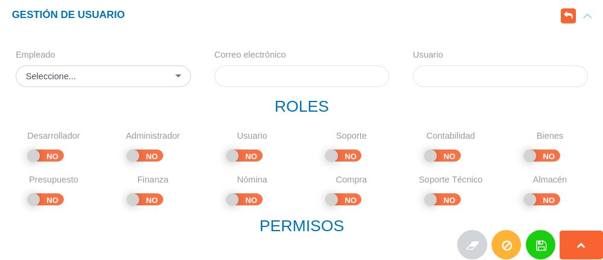

#Configuración de Acceso al Sistema  
***********************************

##Gestión de roles

En esta sección el usuario administrador puede observar los distintos permisos y los módulos a los cuales pertenecen estos permisos, de esta forma, puede asignar permisos de acceso para los distintos roles definidos en el sistema.   

Figura 15: Roles y Permisos

Para La designación de roles y permisos: 

- Acceder como usuario administrador o con un rol de usuario con permisos sobre la **Configuración General del Sistema**
- Seleccionar **Acceso** y ubicarse en la sección **Roles y Permisos** (Figura 15)
- Habilitar y deshabilitar permisos según roles de usuarios y módulos 
- Para guardar o cancelar cualquiera de los cambios hacemos uso de los botones de [acciones de formulario](/information/#botones), ubicados al final de la sección 

##Crear un nuevo usuario

A través de la sección **Usuarios** (Figura 16) de la **Configuración de Acceso al Sistema** podemos crear una cuenta de usuario y gestionar sus roles y permisos.  En la sección se muestra información asociada a las cuentas de usuarios por un historial de registros, haciendo uso de los botones ubicados en la columna titulada **Acción**, donde podemos ver más detalles del usuario, modificar el registro o eliminar el registro.    

Figura 16: Registro de Usuarios

Para la creación de una nueva cuenta usuario se debe:

- Acceder como usuario administrador o con un rol de usuario con permisos sobre la **Configuración General del sistema**
- Seleccionar **Acceso** y ubicarse en la sección **Usuarios**
- Haciendo uso de los botones [acciones de registro](/information/#botones) ubicados en la esquina superior derecha de esta sección, accedemos al formulario **Gestión de usuario** [(Figura 17)](../img/figure_17.png)
- Completamos el formulario con información relacionada al usuario
- Guardamos o cancelamos cualquiera de los cambios haciendo uso de los botones de [acciones de formulario](/information/#botones), ubicados al final de la ventana 
- Verificar que la cuenta de usuario se muestre en el historial de registros una vez guardado.  

###Gestión de usuario

Una vez iniciado el registro de usuario, se muestra el formulario de la sección **Gestión de Usuario** (Figura 17), donde se procederá a completar los campos requeridos, designación de roles y permisos.  

Figura 17: Gestión de Usuarios

Los roles y permisos son designados a través de los botones de selección habilitando cada una de las acciones pertinentes según corresponda al rol de usuario.   

Para la designación de permisos se presentan clasificadas cada una de las acciones pertenecientes a cada módulo.   Una vez se culmine el registro y la designación podemos guardar los cambios al desplazarnos al final del formulario y pulsar la opción **Guardar**. 

###Gestionar cuentas de usuarios ya creadas

- Acceder como usuario administrador o con un rol de usuario con permisos sobre la **Configuración General del sistema**
- Seleccionar **Acceso** y ubicarse en la sección **Usuarios** (Figura 16)
- Presionar el botón **Editar** ubicado en la columna titulada **Acción** de la tabla de registros
- Modificar los datos de interes en la sección **Gestión de usuario** (Figura 17)
- Presionar el botón **Guardar** para registrar los cambios 
- Verificar que la cuenta de usuario se muestre en el historial de registros una vez guardado.  

