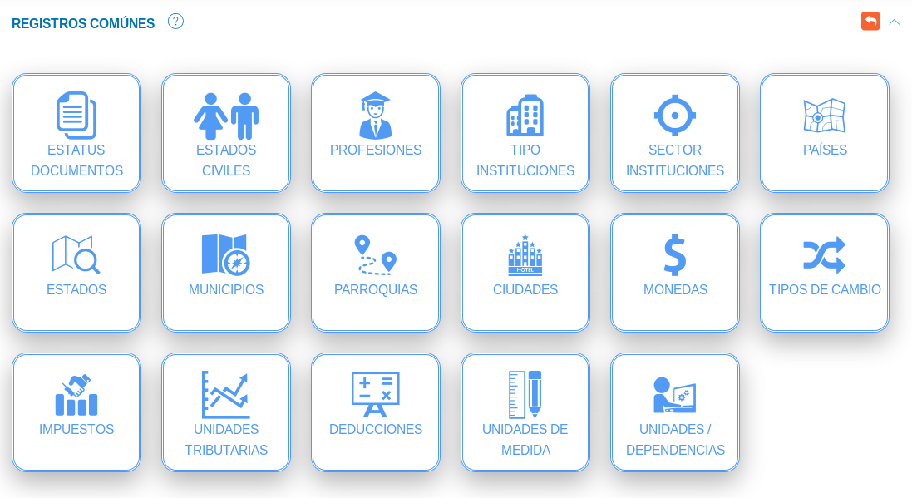
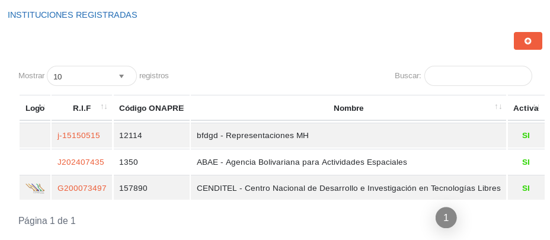
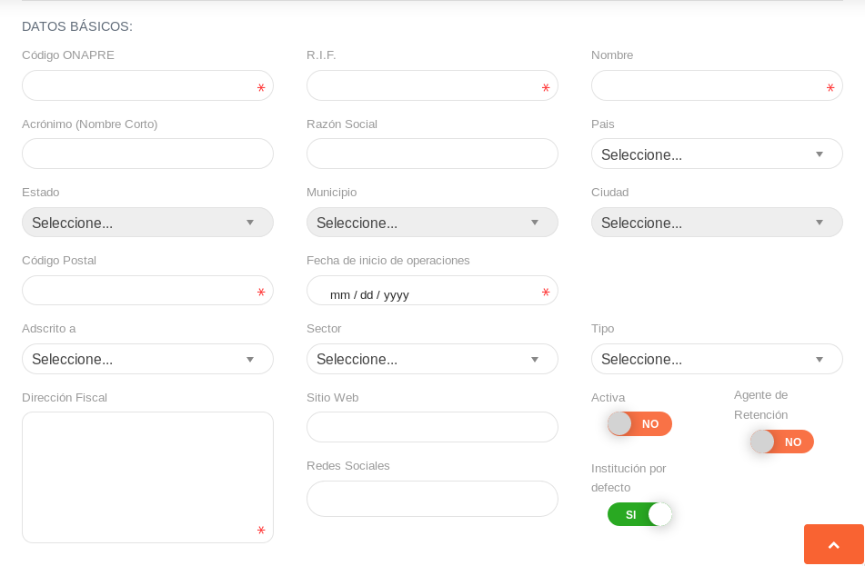
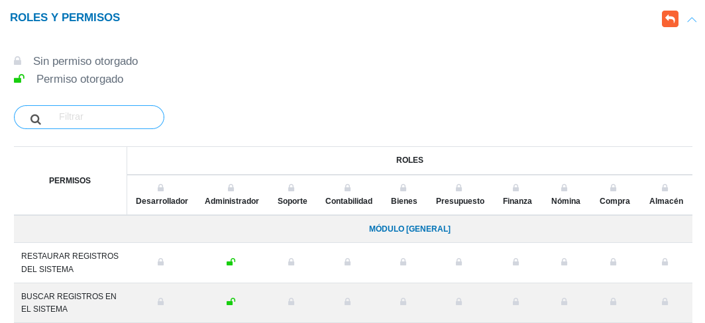
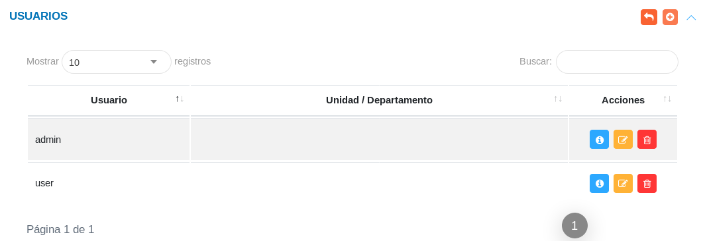

# Administración del sistema 
****************************

La aplicación inicialmente contará con una configuración por defecto que el usuario administrador debe completar a través de los elementos funcionales del sistema, que permitirán ajustar el uso del KAVAC a la estructura organizativa y características de la institución usuaria.   A través del panel de control y la configuración se definirán los parámetros útiles para la consolidación del sistema con relación a las instituciones, sus sedes y características organizacionales.   

##Configuración 

El módulo de **Configuración**, permite integrar las herramientas que van a ser utilizadas a lo largo del sistema. Desde registros previos de la organización y su estructura, así como también, funcionalidades del sistema adaptadas a la institución.   La configuración del sistema permite al usuario administrador gestionar las cuentas de usuarios, módulos y el acceso a las distintas áreas del sistema.

##Configuración general del sistema 

###Parámetros generales

En la sección de parámetros generales, el usuario con permisos sobre la **Configuración** del sistema puede controlar las funcionalidades de la aplicación, habilitando o deshabilitando funciones a través de los botones de selección. 

Para ingresar  a esta sección es necesario:

- Acceder como usuario administrador o con un rol de usuario con permisos sobre la **Configuración** del sistema
- Dirigirse desde el panel lateral a la **Configuración General** y ubicarse en la sección de **Parámetros generales**. 
- Haciendo uso de los botones de selección podemos activar o desactivar cualquiera de la funciones del sistema
- Para ejecutar o cancelar cualquiera de los cambios hacemos uso de los [botones de acciones de formulario](/information/#botones), ubicados en la parte inferior de la sección. 

###Registros Comunes

La sección de registros comunes es una herramienta de la **Configuración** que permite al usuario administrador o un usuario con permisos sobre la **Configuración** ajustar a través de parámetros preestablecidos, el sistema a la organización usuaria.   Los datos registrados en esta sección serán considerados a largo de todo el sistema.

###Registrar Institución  

La **Configuración General del Sistema** incluye una sección titulada **Instituciones Registradas** donde se muestra un historial de instituciones registradas e información relacionada a cada una de ellas, en esta sección además se puede registrar otra institución haciendo uso del boton de acción de registro.   

Para realizar el registro de una Institución se debe:

- Acceder como usuario administrador o con un rol de usuario con permisos sobre la **Configuración General** del sistema
- Ubicarse en la sección **Instituciones Registradas**
- Haciendo uso del boton de [acciones de registro ](/information/#botones), accedemos al formulario de registro de institución 
- Completamos el formulario y guardamos los cambios.
- Finalmente el registro se mostrará en el historial en la sección **Instituciones Registradas** 	

###Configurar institución 

En la **Configuración General del Sistema** se presenta una sección para el **Registro** y **Configuración** de instituciones.  En la sección **Configurar Institución** el usuario debe completar los campos obligatorios y requerimientos relacionados con las características organizacionales de la institución.   Antes de guardar el registro, en esta ventana el usuario puede completar datos adicionales relacionados con la estructura de la institución en la sección **Datos Complementarios**.  

Para configurar la institución se debe seguir los siguientes pasos: 

- Acceder como usuario administrador o con un rol de usuario con permisos sobre la **Configuración General** del sistema
- Ubicarse en la sección **Configurar Institución**
- Completar los datos básicos y complementarios de la institución
- Para ejecutar o cancelar cualquiera de los cambios hacemos uso de los botones de [acciones de formulario](/information/#botones), ubicados en la parte inferior de la sección

Configurar Logos y banners institucionales 

En la sección **Configurar Institución** de la **Configuración General del Sistema** podemos añadir el logotipo y el banner institucional.  Para adjuntar la imagen simplemente ingresamos en alguno de los recuadros, y el sistema nos conducirá a un directorio para cargar la imagen. 

##Configuración de acceso al sistema 

###Gestión de roles

En esta sección el usuario administrador puede observar los distintos permisos y los módulos a los cuales pertenecen estos permisos, de esta forma, puede asignar permisos de acceso para los distintos roles definidos en el sistema.   

Para La designación de roles y permisos: 

- Acceder como usuario administrador o con un rol de usuario con permisos sobre la **Configuración General del Sistema**
- Seleccionar **Acceso** y ubicarse en la sección **Roles y Permisos**
- Habilitar y deshabilitar permisos según roles de usuarios y módulos 
- Para guardar o cancelar cualquiera de los cambios hacemos uso de los botones de [acciones de formulario](/information/#botones), ubicados al final de la sección 

###Crear un nuevo usuario

A través de la sección **Usuarios** de la **Configuración de Acceso al Sistema** podemos crear una cuenta de usuario y gestionar sus roles y permisos.  En la sección se muestra información asociada a las cuentas de usuarios por un historial de registros, haciendo uso de los botones ubicados en la columna titulada **Acción** podemos ver mas detalles del usuario, modificar el registro o eliminar el registro.    

Para la creación de una nueva cuenta usuario se debe:

- Acceder como usuario administrador o con un rol de usuario con permisos sobre la **Configuración General del sistema**
- Seleccionar **Acceso** y ubicarse en la sección **Usuarios**
- Haciendo uso de los botones [acciones de registro](/information/#botones), accedemos al formulario **Gestión de usuario** 
- Completamos el formulario con información relacionada al usuario
- Guardamos o cancelamos cualquiera de los cambios haciendo uso de los botones de [acciones de formulario](/information/#botones), ubicados al final de la ventana 
- La cuenta usuario debe mostrarse en el historial de registros una vez guardado.  

Gestión de usuario

Una vez iniciado el registro de usuario, se despliega una ventana titulada **Gestión de Usuario**, donde se procederá a completar los campos requeridos, designación de roles y permisos.   Los campos corresponden a tipo de empleado, dirección de correo electrónico y nombre del usuario. Los roles y permisos son designados a través de los botones de selección habilitando cada una de la acciones pertinentes según corresponda al rol de usuario.   Para la designación de permisos se presentan clasificadas cada una de las acciones pertenecientes a cada módulo.   Una vez se culmine el registro y la designación podemos guardar los cambios al desplazarnos al final del formulario. 

##Configuración de módulos del sistema 

###Aplicaciones

El rol de usuario como desarrollador habilita la funcionalidad de configuración del sistema para la gestión de módulos como incorporación o desincorporación, haciendo accesible algunas opciones de configuración avanzadas en toda la aplicación.  KAVAC está diseñado con el objetivo de garantizar independencia entre los módulos para con el sistema base, de modo que, no afecta en ningún sentido la incorporación o desincorporación de alguno de los módulos.    

###Gestión de módulos 

Como se observo en el capítulo previo en la **Instalación del Sistema** especificamente en la sección de **Registros Iniciales**, ejecutamos el comando **php artisan module: seed** para revisar que módulos del sistema están habilitados y registrar información requerida por cada uno de ellos.  Desde la instalación del sistema podemos gestionar cada módulo y sus propiedades, sin embargo, es posible realizar gestión de módulos como usuario administrador y desarrollador desde la interfaz gráfica del sistema ya instalado.   

###Incorporar y desincorporar módulos

Para la gestión de módulos del sistema, es necesario dirigirse a la Configuración y seleccionar Módulos. En esta sección del sistema podemos apreciar los módulos disponibles, instalados o por instalar, de igual forma, la opción para desinstalar alguno de ellos. A través del botón de color verde podemos realizar la instalación y el botón de color rojo nos permite desinstalar el módulo; de igual forma, se muestra un indicador del estado del módulo ya sea instalado o por instalar.

##Catálogo de aplicaciones 

[Contabilidad](#)

[Bienes](#)

[Presupuesto](#)

[Atención al ciudadano](#)

[Firma electrónica](#)

[Finanzas](#) 
 
[Talento Humano](#) 

[Compras](#) 

[Soporte técnico](#)

[Depósito](#)

